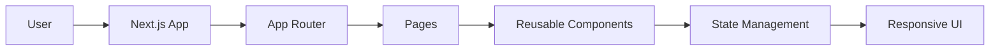

<div align="center">

# EduSync LMS

### Modern Learning Management System

**Software Engineering Internship Project**  
**Ailexity Technology Pvt. Ltd.**

A modern Learning Management System (LMS) built with **Next.js**, **React**, and **TypeScript**, designed to deliver an intuitive, responsive, and scalable educational platform.

---


</div>

---

# About

EduSync is a modern Learning Management System (LMS) developed during my Software Engineering Internship at **Ailexity Technology Pvt. Ltd.**

The project focuses on creating a clean, scalable, and responsive user interface while following modern React development practices. The application is built using the Next.js App Router architecture and emphasizes modular component design, reusable UI elements, and maintainable project organization.

---

# My Contributions

During my internship, I contributed to the frontend development of EduSync by:

- Developing responsive user interfaces using React and Next.js
- Building reusable and modular UI components
- Implementing responsive layouts across different screen sizes
- Structuring application pages using the Next.js App Router
- Improving component organization and maintainability
- Integrating animations for smoother user interactions
- Managing application state using Zustand
- Following clean code practices and component-based architecture

---

# Features

- Responsive LMS interface
- Modern dashboard design
- Student-focused UI
- Course navigation
- Modular component architecture
- Smooth page transitions
- Responsive layouts
- Reusable UI system
- Optimized routing using Next.js
- State management with Zustand

---

# Tech Stack

| Category | Technology |
|-----------|------------|
| Framework | Next.js 15 |
| Library | React 19 |
| Language | TypeScript |
| Styling | Tailwind CSS |
| Animation | Framer Motion |
| Icons | Lucide React |
| State Management | Zustand |
| Package Manager | npm |
| Linting | ESLint |

---

# Project Architecture

```text
                    User
                     │
                     ▼
              Next.js Application
                     │
      ┌──────────────┼──────────────┐
      │              │              │
      ▼              ▼              ▼
   App Router     Components      State
                                  (Zustand)
      │              │              │
      └──────────────┼──────────────┘
                     │
                     ▼
              Responsive UI
```

---

# Folder Structure

```text
edusync/
│
├── app/
│   ├── layout.tsx
│   ├── page.tsx
│   └── globals.css
│
├── components/
│   ├── ui/
│   └── ...
│
├── lib/
│
├── types/
│
├── public/
│
├── package.json
├── tailwind.config.ts
├── next.config.ts
└── tsconfig.json
```

---

# Application Flow



---

# Engineering Principles

The project follows several modern frontend engineering practices:

- Component-based architecture
- Separation of concerns
- Reusable UI components
- Type-safe development using TypeScript
- Responsive-first design
- Centralized state management
- Clean project organization
- Maintainable codebase
- Scalable folder structure

---

# Installation

## Clone Repository

```bash
git clone https://github.com/yourusername/edusync.git
```

## Navigate into the project

```bash
cd edusync
```

## Install dependencies

```bash
npm install
```

## Start development server

```bash
npm run dev
```

Visit:

```
http://localhost:3000
```

---

# Project Structure

```text
Frontend
│
├── Next.js 15
├── React 19
├── TypeScript
├── Tailwind CSS
├── Zustand
└── Framer Motion
```

---

# Development Highlights

✔ Modern React Architecture

✔ Next.js App Router

✔ TypeScript

✔ Responsive Design

✔ Reusable Components

✔ State Management

✔ Scalable Folder Structure

✔ Clean Code Practices

✔ Frontend Performance Optimization

✔ Maintainable Codebase

---

# Learning Outcomes

During this internship I strengthened my understanding of:

- Modern React development
- Next.js App Router architecture
- Component-driven UI development
- State management patterns
- Responsive web design
- TypeScript best practices
- Project organization for production applications
- Collaborative software development workflows
- Version control using Git

---

# Acknowledgements

This project was developed as part of my **Software Engineering Internship at Ailexity Technology Pvt. Ltd.** The internship provided valuable exposure to modern frontend development practices, collaborative workflows, and scalable application architecture.

---

# License

This repository is shared for portfolio and educational purposes.

